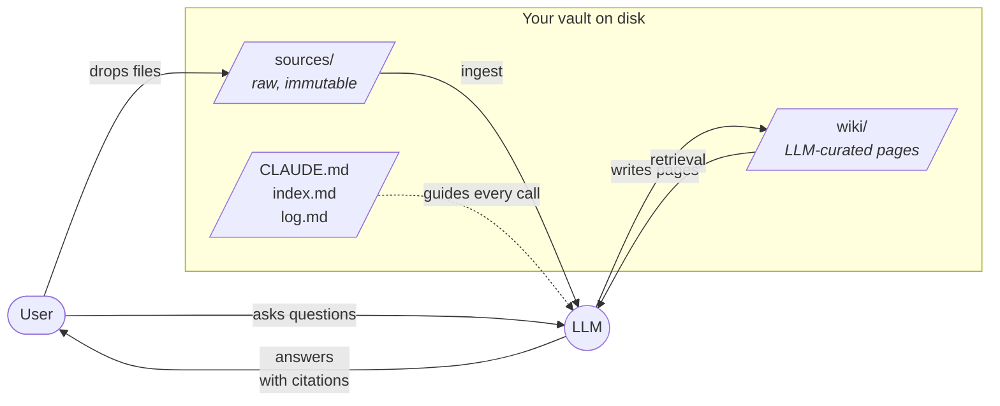

# scriptorium

**An LLM-maintained Obsidian vault, written in Rust.** Drop sources in,
ask questions, let the LLM keep the wiki tidy. The vault is just
markdown + git + SQLite on disk, so your editor, grep, and Obsidian all
still work.

---

## What is it?

Scriptorium is a Rust implementation of [Karpathy's "LLM Wiki"
pattern][karpathy-gist]: a persistent, interlinked markdown knowledge base
that an LLM continuously curates for you. You supply the raw inputs
(papers, articles, transcripts, notes); the LLM does the bookkeeping —
summaries, cross-references, citations, and an append-only log of what
it touched and when.

[karpathy-gist]: https://gist.github.com/karpathy/442a6bf555914893e9891c11519de94f

The problem it solves: **conversational LLMs forget**. If you're building
up understanding of a topic over weeks, a chat thread is a terrible
substrate — it's linear, ephemeral, and hard to revisit. A markdown
vault is a good substrate (grep works, git tracks history, the files
outlive any particular model), but it lacks a curator. Scriptorium is
that curator, plus guardrails that keep it from corrupting the vault
when it makes a mistake.

The vault format **is** an Obsidian vault — you can open the same
directory in Obsidian and in scriptorium at once. Obsidian gives you the
graph view and plugin ecosystem; scriptorium gives you the LLM operator.

## Status

**v1 is feature-complete and tested end-to-end** — 113 passing tests across
3 crates, zero clippy warnings, mock-driven integration tests cover
ingest / query / lint / patches / search without needing API keys. The
CLI has 9 subcommands; the MCP server exposes 8 tools over stdio.

**Deferred to v2** (explicitly not claimed to work): PDF/HTML ingest,
hybrid BM25+vector search, HTTP/SSE MCP transport, LLM-assisted lint
rules, `wiki/`-edit embedding refresh, remote git push/pull. See the
[architecture doc][arch] for the full list.

[arch]: docs/ARCHITECTURE.md

## The 30-second mental model



Three layers: `sources/` (raw inputs you drop in), `wiki/` (LLM-maintained
markdown pages), and three schema files (`CLAUDE.md` as the rule book,
`index.md` as a generated catalog, `log.md` as an append-only timeline).
The LLM is the operator that moves content from left to right, guided by
the rules in `CLAUDE.md`.

## Quickstart

```sh
# 1. Build.
cargo build --workspace
export PATH="$PWD/target/debug:$PATH"

# 2. Scaffold a fresh vault.
scriptorium init /tmp/my-vault
# → "scriptorium init: scaffolded vault at /tmp/my-vault"
#
# Creates:
#   /tmp/my-vault/
#   ├── .gitignore
#   ├── CLAUDE.md               (the schema — the rules the LLM follows)
#   ├── index.md                (generated content catalog)
#   ├── log.md                  (append-only op log)
#   ├── .scriptorium/config.toml
#   ├── sources/{articles,data}/
#   └── wiki/{concepts,entities,topics}/
#
# Also `git init`s the directory and makes one commit: "scriptorium: init vault".

# 3. Inspect what you got.
scriptorium -C /tmp/my-vault config
scriptorium -C /tmp/my-vault lint         # "lint: clean ✓"
( cd /tmp/my-vault && git log --oneline ) # one commit

# 4. Run the full test suite — this is the canonical end-to-end proof
#    that ingest / query / lint / patches all work. It's driven by a
#    mock LLM, so no API keys or network calls.
cargo test --workspace
# → 99 + 9 + 5 = 113 passing, 0 failures.

# 5. Use it for real: drop a source file, set up an API key, ingest.
echo "# Attention is parallel" > /tmp/my-vault/sources/articles/notes.md
export SCRIPTORIUM_ANTHROPIC_API_KEY=sk-ant-...
scriptorium -C /tmp/my-vault ingest /tmp/my-vault/sources/articles/notes.md
scriptorium -C /tmp/my-vault query "how does attention work?"
```

> **Note on `--provider mock`.** The mock provider used in the test suite
> is fully exercised there, but the CLI's `--provider mock` flag wires up
> `MockProvider::constant("{}")`, which is not a valid `IngestPlan` — so
> `scriptorium ingest --provider mock` will fail with a JSON parse error.
> Use a real provider for CLI ingest/query. The e2e tests at
> [`crates/scriptorium-core/tests/e2e.rs`](crates/scriptorium-core/tests/e2e.rs)
> demonstrate the full pipeline under the mock.

## The crates

| Crate | Purpose |
|---|---|
| [`scriptorium-core`](crates/scriptorium-core/) | Library: vault + page model, wikilinks, link graph, `VaultTx` (atomic writes), schema loader, mechanical lint, `LlmProvider` trait + 5 impls (Claude, OpenAI, Gemini, Ollama, Mock), embeddings store, ingest, query, watch. |
| [`scriptorium-cli`](crates/scriptorium-cli/) | The `scriptorium` binary. Nine `clap` subcommands. |
| [`scriptorium-mcp`](crates/scriptorium-mcp/) | MCP server (hand-rolled JSON-RPC 2.0 over stdio) exposing 8 tools. |

## CLI commands

| Command | One-liner |
|---|---|
| `scriptorium init [PATH]` | Scaffold a fresh vault from bundled templates + `git init`. |
| `scriptorium ingest <SOURCE>` | Read a source file, prompt the LLM, commit the resulting wiki pages + log entry. |
| `scriptorium query <QUESTION>` | Embed the question, top-k retrieve from the embeddings store, prompt the LLM, return a cited answer. |
| `scriptorium reindex` | Re-embed every page in the vault (idempotent — cached pages are skipped). |
| `scriptorium lint [--strict]` | Run the mechanical lint rules (broken links, orphans, frontmatter). |
| `scriptorium undo` | `git revert HEAD` — undo the most recent scriptorium commit. |
| `scriptorium config` | Print the resolved config (`.scriptorium/config.toml` + env overrides). |
| `scriptorium serve` | Run the MCP server on stdio so Claude Code (or any MCP client) can drive this vault as native tools. |
| `scriptorium watch` | Watch `sources/` and auto-ingest any new `.md` / `.txt` that lands there. |

Every command takes a `-C PATH` / `--vault PATH` flag to point at a vault
other than `.`, and a `--provider claude|openai|ollama|mock` flag to
override the config's default.

## MCP tools

When you run `scriptorium serve --provider claude` and register it with
Claude Code (`claude mcp add scriptorium -- scriptorium serve ...`), these
eight tools become available:

| Tool | What it does |
|---|---|
| `scriptorium_ingest` | Ingest a source file into the vault and return the commit id. |
| `scriptorium_query` | Answer a question against the vault with citations. |
| `scriptorium_lint` | Run mechanical lint rules and return the report. |
| `scriptorium_list_pages` | List all wiki pages with their titles, paths, and tags. |
| `scriptorium_read_page` | Read a wiki page as markdown. Vault-relative path; `..` rejected. |
| `scriptorium_write_page` | Create or update a page under `wiki/`. Paths outside `wiki/` are rejected. |
| `scriptorium_search` | Semantic top-k search over the embeddings store. |
| `scriptorium_log_tail` | Return the last N lines of `log.md`. |

## Where to read next

- **[`docs/ARCHITECTURE.md`](docs/ARCHITECTURE.md)** — the deep dive.
  Covers the why (Karpathy pattern, trust model), the what (three-layer
  model, vault layout, Page + PageId + LinkGraph), and the how (VaultTx
  pipeline, ingest/query sequences, LLM providers, embeddings cache,
  MCP server). Six Mermaid diagrams. Read this before touching the code.
- **[`templates/CLAUDE.md`](templates/CLAUDE.md)** — the starter schema
  that ships with `scriptorium init`. This is the contract between you
  and the LLM: the rules for what pages should look like, what the LLM
  should do, and what it must never do. Every vault has its own copy
  that you're free to customize.
- **Generated API docs** — run
  `cargo doc --workspace --no-deps --document-private-items` and open
  `target/doc/scriptorium_core/index.html`. Every module has a
  top-of-file `//!` comment explaining what it does and why.
- **[`crates/scriptorium-core/tests/e2e.rs`](crates/scriptorium-core/tests/e2e.rs)** —
  the shortest path from "I understand the types" to "I see it work
  end-to-end". The whole pipeline (ingest, query, lint) runs against a
  fixture vault with a mock LLM in under 100ms.

## Build, test, check

```sh
cargo build --workspace
cargo test  --workspace                                 # 113 tests
cargo clippy --workspace --all-targets -- -D warnings   # zero warnings
cargo fmt --check                                       # zero diffs
cargo doc --workspace --no-deps --document-private-items
```

## License

GPL-3.0-only. See [LICENSE](LICENSE) for details.
