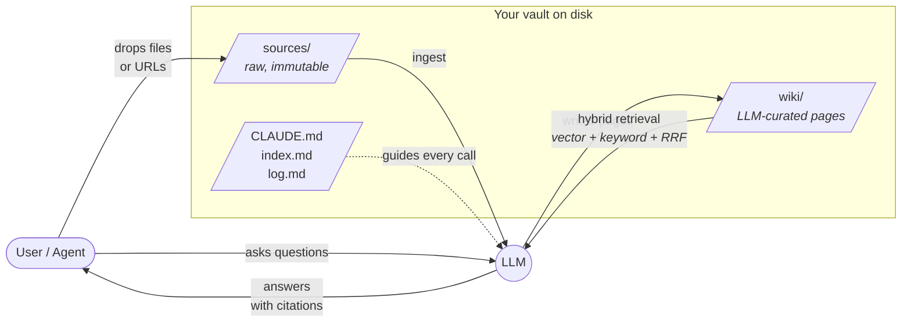

# Scriptorium

**Persistent memory for LLM agents, built in Rust.** Scriptorium turns
ephemeral conversations into a durable, interlinked knowledge base that
grows with every session. It gives any LLM a long-term memory layer
grounded in sources, citations, and mechanical integrity checks — so the
agent compounds understanding instead of forgetting it.

The vault is plain markdown, git-versioned SQLite, and Obsidian-compatible.
Your editor, `grep`, and the Obsidian graph view all still work.

---

## The problem

Conversational LLMs forget. Even with million-token context windows,
conversations are linear, ephemeral, and hard to revisit. If you're
building up understanding of a topic over weeks — reading papers, making
connections, noticing contradictions — a chat thread is a terrible
substrate. A markdown vault is a good substrate (files on disk, git
tracks history, `grep` works, the files outlive any particular model),
but it lacks a curator.

Scriptorium is that curator: an LLM operator that reads your sources,
writes structured wiki pages, maintains cross-references, and never
invents a fact it can't trace back to a source. When it makes a
mistake, mechanical lint catches it before it lands, and `git revert`
undoes the rest.

## How it works



Three layers: **`sources/`** holds raw inputs the LLM never modifies.
**`wiki/`** holds LLM-maintained pages — one concept per page,
cross-linked with `[[wikilinks]]`, every claim traced to a source.
**`CLAUDE.md`** is the schema: the rules the LLM follows on every call.

Three core operations:

| Operation | What happens |
|-----------|-------------|
| **Ingest** | Read a source (local file or URL), prompt the LLM, create or update wiki pages, commit to git |
| **Query** | Embed the question, hybrid search (vector + keyword + RRF fusion), prompt the LLM, return a cited answer |
| **Maintain** | Lint for broken links, orphan pages, stale embeddings; optionally auto-fix |

Every mutation produces exactly one git commit. `scriptorium undo` is
`git revert HEAD`. The vault is designed to be recoverable, not
perfectly reliable.

## Quickstart

```sh
# Install from source (single binary, no runtime dependencies)
cargo install --path crates/scriptorium-cli

# Scaffold a vault
scriptorium init ~/my-vault

# Interactive setup — choose providers, store API keys in macOS Keychain
scriptorium -C ~/my-vault setup

# Ingest a source
scriptorium -C ~/my-vault ingest ~/papers/attention-is-all-you-need.pdf

# Ingest from a URL (fetches, runs Readability, converts to markdown)
scriptorium -C ~/my-vault ingest --url https://example.com/article

# Ask a question
scriptorium -C ~/my-vault query "how does multi-head attention work?"

# Health check (no LLM required)
scriptorium -C ~/my-vault doctor
```

## Use it as an MCP server

Register scriptorium as an MCP tool server for Claude Code (or any MCP
client):

```sh
claude mcp add scriptorium -- scriptorium serve --provider claude
```

The agent can then call 16 tools natively:

| Tool | Purpose |
|------|---------|
| `scriptorium_ingest` | Ingest a local file or URL into the vault |
| `scriptorium_query` | Answer a question with cited sources |
| `scriptorium_search` | Semantic top-k search over the embeddings store |
| `scriptorium_lint` | Run mechanical integrity checks |
| `scriptorium_maintain` | Full maintenance cycle with optional auto-fix |
| `scriptorium_doctor` | Vault health check (no LLM required) |
| `scriptorium_list_pages` | List all wiki pages with titles, paths, and tags |
| `scriptorium_read_page` | Read a wiki page as markdown |
| `scriptorium_write_page` | Create or update a wiki page under `wiki/` |
| `scriptorium_log_tail` | Tail the append-only operation log |
| `scriptorium_skill_list` | List available agent workflow skills |
| `scriptorium_skill_read` | Read a skill's full instruction set |
| `scriptorium_bench` | Run retrieval quality benchmarks (P@k, MRR, NDCG) |
| `scriptorium_learn_capture` | Record a learning (pattern, pitfall, correction) |
| `scriptorium_learn_search` | Search the self-learning journal |
| `scriptorium_learn_retrieve` | Retrieve learnings by tag for prompt injection |

## Key design decisions

**ULID page IDs as the merge key.** Pages can be renamed, moved between
directories, or have their titles rewritten — the ID stays stable.
Embeddings, backlinks, and patches all key on the ID, not the filename.

**Mechanical lint gates every write.** `VaultTx::commit` validates the
full vault state (existing pages + pending writes) before any bytes
touch disk. Broken wikilinks, malformed frontmatter, duplicate IDs —
each one aborts the commit. The LLM cannot corrupt the vault's
structural integrity.

**Citation-hallucination guard.** The query pipeline strips any page
reference from the LLM's answer that wasn't in the retrieved set. Even
if the model invents `[[nonexistent]]`, the caller never sees it.

**Content hashing for stale detection.** Every page has a SHA-256 hash.
Patches reject themselves if the on-disk page changed since the LLM
last read it. The embeddings cache skips pages it has already vectorized
at the current hash.

**Git as the undo log.** Every mutation is one commit. No custom
rollback machinery — git already knows how to do this.

**Single-writer lockfile.** Two scriptorium processes against the same
vault serialize on `flock(2)`. No interleaved writes, no corrupted log.

## Architecture

~28k lines of Rust across three crates:

| Crate | Purpose |
|-------|---------|
| [`scriptorium-core`](crates/scriptorium-core/) | Library: vault model, wikilinks, link graph, `VaultTx` (atomic writes), schema loader, mechanical lint, `LlmProvider` trait + 5 implementations (Claude, OpenAI, Gemini, Ollama, Mock), hybrid search (vector + FTS5 + RRF), embeddings store, ingest, query, maintenance, learnings, skills, hooks, keychain, social import, URL fetch |
| [`scriptorium-cli`](crates/scriptorium-cli/) | The `scriptorium` binary. 20+ `clap` subcommands including `setup`, `doctor`, `bench`, `learn`, `skill`, `social`, `vault` (multi-vault management) |
| [`scriptorium-mcp`](crates/scriptorium-mcp/) | MCP server (JSON-RPC 2.0 over stdio) exposing 16 tools. Hand-rolled — no `rmcp` dependency |

The shape is hexagonal / ports-and-adapters: the CLI and MCP server are
two clients that share the same core library. The LLM provider is a
trait — swapping Claude for Gemini is a config change, not a code
change. Replacing the embedding store is a one-module swap.

**Provider support:**

| Provider | Chat | Embeddings | Structured output |
|----------|------|-----------|-------------------|
| Claude (Anthropic) | Messages API | — (use separate provider) | Tool-use schema trick |
| OpenAI | Chat Completions | `text-embedding-3-small` | Native `json_schema` strict mode |
| Gemini | `generateContent` (1M context) | `gemini-embedding-2-preview` | JSON mode + caller validation |
| Ollama | `/api/chat` | `/api/embeddings` | Best-effort `format: "json"` |
| Mock | Canned fixtures | Deterministic SHA-256 vectors | For testing — 307 tests, no API keys |

Providers can be mixed: `[llm].provider = "claude"` with
`[embeddings].provider = "gemini"` is a common and supported
configuration.

## Self-improving agents

Scriptorium includes infrastructure for agents that get better over time:

**Self-learning journal.** Agents capture patterns, pitfalls,
corrections, and domain knowledge into `.scriptorium/learnings.jsonl`.
Learnings have typed confidence scores with time-based decay; high-
confidence entries are injected into LLM prompts as context. The journal
is local to each machine, not vault content.

**Skills.** Named markdown instruction sets (`skills/*/SKILL.md`) that
teach agents how to perform specific workflows — ingest, query,
maintain, review, learn. Agents discover skills via the MCP server and
read them before executing a workflow. Ships with 5 built-in skills;
vaults can add their own.

**Retrieval benchmarks.** Define `(query, expected_stems)` test cases in
`.scriptorium/benchmarks.json`. The `bench` command runs hybrid search
for each case and reports precision@k, recall, MRR, NDCG, F1, and a
composite health score. Use it to catch retrieval regressions after
schema changes or provider swaps.

**Lifecycle hooks.** Shell commands fired at key points in the pipeline
(`pre_ingest`, `post_ingest`, `post_maintain`). Pre-hooks can abort
operations; post-hooks are fire-and-forget. Configured in
`.scriptorium/config.toml`.

## CLI commands

| Command | Description |
|---------|-------------|
| `init [PATH]` | Scaffold a fresh vault with templates + `git init` |
| `setup` | Interactive wizard: providers, API keys (macOS Keychain), config |
| `ingest <SOURCE>` | Ingest a local file or `--url` into the vault |
| `bulk-ingest <DIR>` | Batch ingest a directory with checkpoint resume |
| `query <QUESTION>` | Ask a question with hybrid retrieval and citations |
| `reindex` | Rebuild the embeddings store (idempotent, hash-cached) |
| `lint [--fix]` | Run mechanical integrity checks, optionally auto-fix |
| `doctor [--json]` | 8-point health check (no LLM required) |
| `maintain [--fix]` | Full maintenance cycle: lint + stale + embeddings |
| `bench [--init]` | Retrieval quality benchmarks (P@k, recall, MRR, NDCG) |
| `undo` | `git revert HEAD` — undo the last scriptorium commit |
| `config` | Print the resolved vault configuration |
| `serve` | Run the MCP server on stdio |
| `watch` | Watch `sources/` and auto-ingest new files |
| `skill list\|show\|init` | Manage agent workflow skills |
| `learn list\|search\|add\|prune` | Manage the self-learning journal |
| `social facebook` | Import Facebook data exports |
| `vault list\|add\|remove\|default\|show` | Multi-vault registry |

Every command accepts `-C PATH` to target a vault other than `.`, and
`--provider` to override the configured LLM.

## Build, test, check

```sh
cargo build --workspace
cargo test  --workspace                                 # 307 tests, <2s
cargo clippy --workspace --all-targets -- -D warnings   # zero warnings
cargo fmt --check                                       # zero diffs
cargo doc --workspace --no-deps --document-private-items
```

## Further reading

- **[`docs/ARCHITECTURE.md`](docs/ARCHITECTURE.md)** — the deep dive.
  Data model, ingest/query pipelines, VaultTx mutation lifecycle,
  LLM provider trait, hybrid search, trust model. Mermaid diagrams
  throughout. Read this before touching the code.
- **[`templates/CLAUDE.md`](templates/CLAUDE.md)** — the starter schema
  shipped with `scriptorium init`. This is the contract between you and
  the LLM: page conventions, tag vocabulary, what it must never do.
- **[`crates/scriptorium-core/tests/e2e.rs`](crates/scriptorium-core/tests/e2e.rs)** —
  the full pipeline under a mock LLM in under 100ms.

## License

GPL-3.0-only. See [LICENSE](LICENSE) for details.
