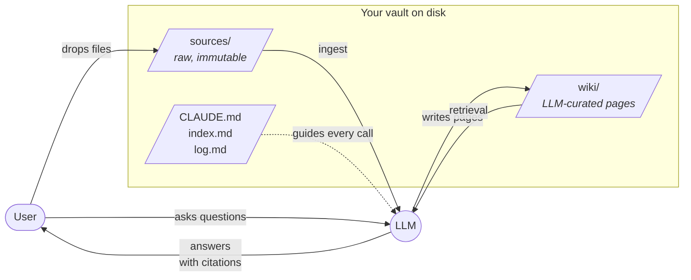
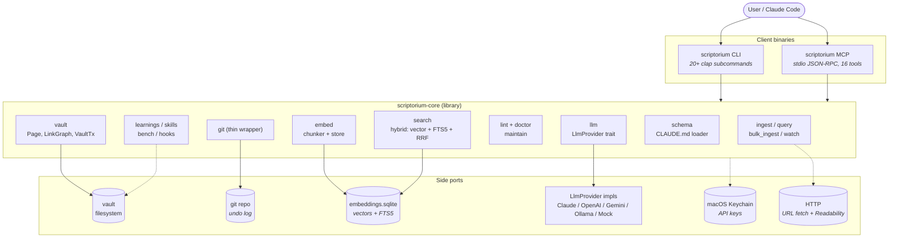
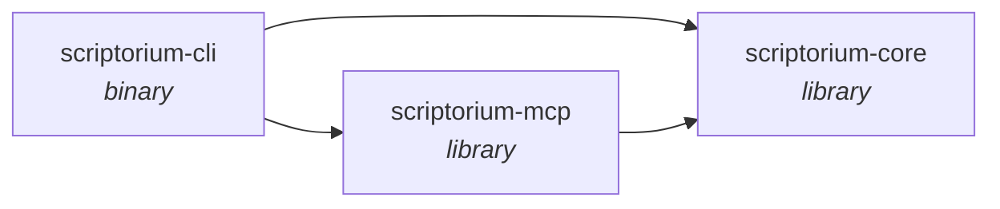
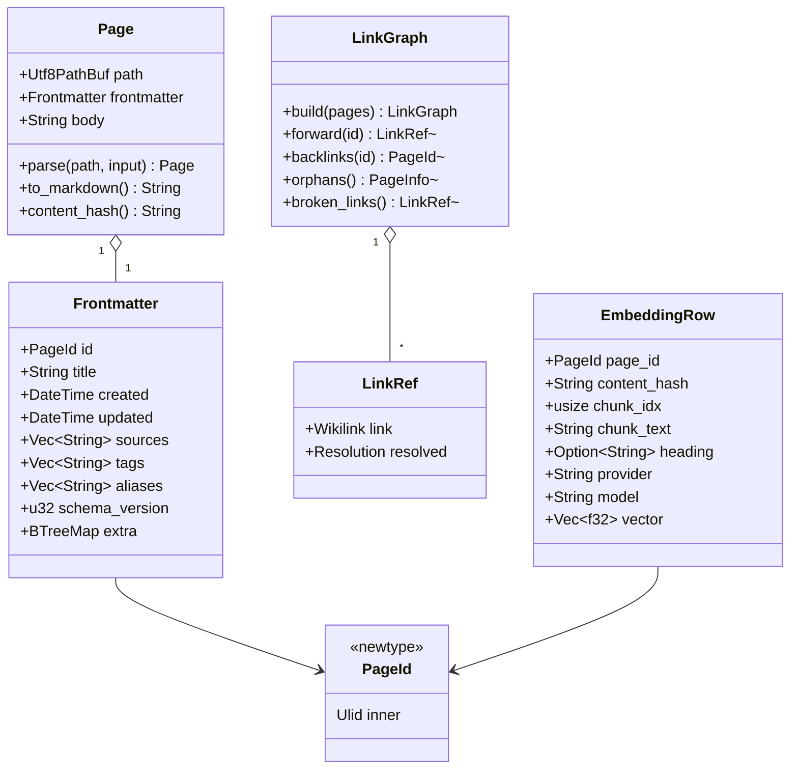
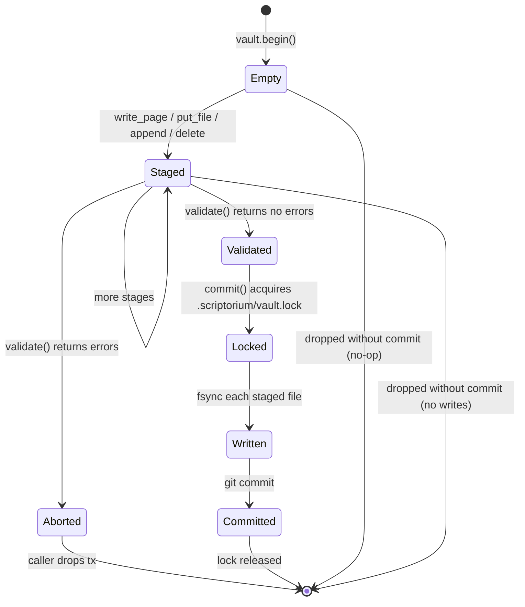
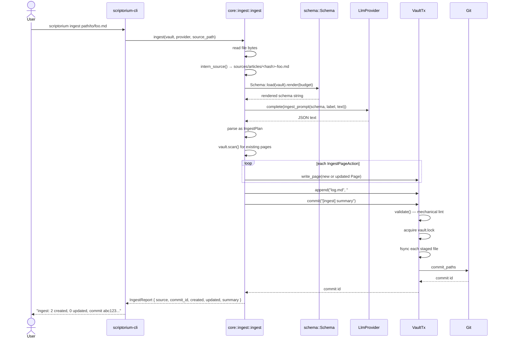
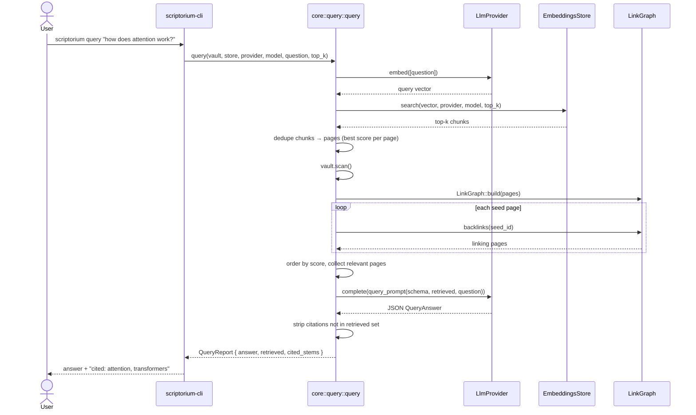
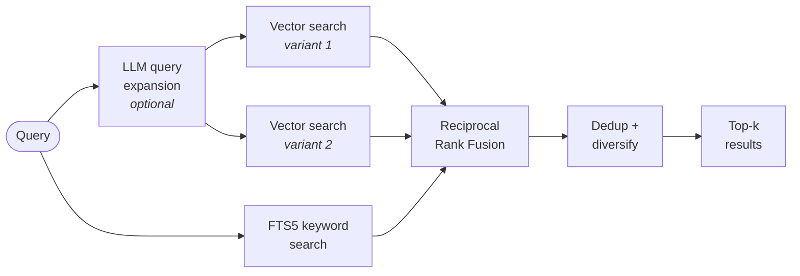
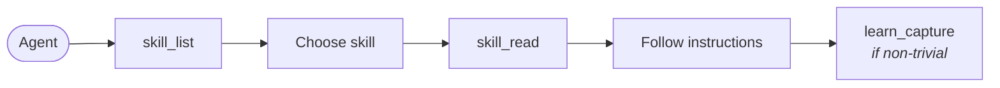

# Scriptorium — Architecture

> A walkthrough of what Scriptorium is, why it exists, and how the 3 crates /
> ~28k lines of Rust fit together. If you've never seen this project before,
> read this end-to-end — you'll leave knowing where to look in the source for
> any follow-up question.

**Audience**: someone who just cloned the repo and wants to understand the
system before touching code. You should be comfortable with Rust basics; no
prior exposure to Obsidian, LLM tooling, or the "LLM wiki" pattern is
assumed.

**Companion docs**:

- [`README.md`](../README.md) — elevator pitch + quickstart.
- [`templates/CLAUDE.md`](../templates/CLAUDE.md) — the contract scriptorium
  ships as the starter schema for a new vault. If you want to know the
  *user-facing* rules for what pages should look like, read that file. This
  document covers the *implementation* that enforces them.
- `cargo doc --workspace --no-deps --document-private-items` — full API
  reference generated from every module's `//!` comment.

---

## Table of Contents

1. [Why Scriptorium exists](#1-why-scriptorium-exists)
2. [What it is](#2-what-it-is)
3. [How it's built](#3-how-its-built)
4. [Self-improving agents](#4-self-improving-agents)
5. [Testing](#5-testing)
6. [Roadmap](#6-roadmap)
7. [Glossary](#7-glossary)
8. [Reading the source](#8-reading-the-source)
9. [Operating it: costs and troubleshooting](#9-operating-it-costs-and-troubleshooting)

---

## 1. Why Scriptorium exists

### 1.1 The "LLM Wiki" pattern

Andrej Karpathy wrote a short [gist][karpathy-gist] describing a simple but
powerful idea: instead of using a chat thread as the substrate for
accumulating knowledge with an LLM, use a **persistent, interlinked markdown
wiki** that the LLM continuously curates on your behalf. The human supplies
sources (articles, PDFs, notes, transcripts) and asks questions; the LLM
does the bookkeeping — summaries, cross-references, contradiction detection,
logging what it learned and when.

[karpathy-gist]: https://gist.github.com/karpathy/442a6bf555914893e9891c11519de94f

The pattern has three layers:

1. **Raw sources** — the immutable ground truth. Articles you dropped in,
   papers you clipped, interview transcripts. The LLM reads from this layer
   but never writes to it.
2. **The wiki** — a set of markdown pages, one per concept or entity, cross-
   linked with `[[wikilinks]]`. This is where summaries, connections, and the
   LLM's synthesis live. Every page traces back to at least one source.
3. **The schema** — a single file (`CLAUDE.md`) that tells the LLM what pages
   should look like, what conventions to follow, and what it must never do.

And three core operations:

- **Ingest**: take a source, update or create wiki pages, log the event.
- **Query**: answer a question using only what the wiki says, with citations.
- **Lint**: find broken links, orphans, contradictions, stale claims.

Scriptorium is a Rust implementation of this pattern.

### 1.2 The problem it solves

Conversational LLMs forget. Even with long-context windows, conversations are
linear, ephemeral, and hard to revisit. If you want to build up knowledge
about a topic over weeks — reading papers, making connections, noticing
contradictions — you need a substrate that survives past the next context
reset. A markdown vault is the simplest such substrate: it's files on disk,
your editor can open it, `grep` works, git tracks history, and it outlives
any particular model.

What a markdown vault lacks is the *curator* — the patient librarian who
rewrites your notes, connects them, and notices when something new
contradicts something old. Scriptorium is that curator, plus the
guardrails that stop it from corrupting the vault when it makes a mistake.

### 1.3 Why Obsidian-compatible

[Obsidian][obsidian] is a desktop app that renders a folder of markdown files
as a navigable, linked knowledge base. It's popular, free for personal use,
has an excellent graph view, and does not control your data — a vault is
just a folder you can open with any editor.

[obsidian]: https://obsidian.md

Scriptorium's vault format **is** an Obsidian vault. You can open the same
directory in Obsidian and in scriptorium at the same time. Scriptorium
writes YAML frontmatter, uses `[[stem]]` wikilink syntax, and avoids
touching `.obsidian/`. Obsidian provides the graph view, backlink panel, and
plugin ecosystem; scriptorium provides the LLM curator. They don't step on
each other.

### 1.4 Why Rust

Four practical reasons:

- **Single-binary distribution.** `cargo build --release` produces one
  executable. No Python virtualenv, no Node modules, no runtime install
  steps for end users.
- **Fast vault scans.** Walking a vault of hundreds of markdown files and
  parsing frontmatter takes milliseconds, not seconds.
- **Safe concurrent filesystem access.** Scriptorium juggles a vault
  lockfile, git operations via libgit2, a SQLite embeddings cache, and an
  HTTP client for LLM APIs. Rust's ownership model catches the races at
  compile time instead of during a data-loss incident.
- **One process for both CLI and MCP.** The same binary runs as
  `scriptorium ingest ...` or as `scriptorium serve --stdio` (an MCP server
  Claude Code can drive). No duplication of logic between a "CLI tool" and
  a "language server".

### 1.5 The trust model

An LLM will, eventually, hallucinate. It will invent a citation, rewrite a
fact wrong, or link to a page that doesn't exist. Scriptorium's job is to
make that cheap to detect and cheap to undo.

The concrete rules the LLM must follow live in
[`templates/CLAUDE.md`](../templates/CLAUDE.md) ("What the LLM must never
do"). The code-level enforcement spans several layers:

- **Mechanical lint gates every write.**
  [`VaultTx::commit`](../crates/scriptorium-core/src/vault/tx.rs) calls
  `validate()` before any bytes touch disk. Broken wikilinks, malformed
  frontmatter, duplicate page IDs — each one is an `Error`-severity
  `LintIssue`, and any `Error` aborts the commit.
- **Citation validation.**
  [`core::query`](../crates/scriptorium-core/src/query.rs) strips any page
  stem from the LLM's answer that wasn't in the retrieved set, so a
  hallucinated `[[nonexistent]]` never leaks out to the caller.
- **Content hashing.** Every page has a SHA-256 over its full rendered
  markdown. If the LLM proposes a patch against a page that changed since
  the LLM last read it, the patch is rejected as stale. See
  [`vault::patch::PatchError::Stale`](../crates/scriptorium-core/src/vault/patch.rs).
- **Git as the undo log.** Every mutation produces exactly one git commit.
  `scriptorium undo` is just `git revert HEAD`. You can always roll back.
- **A single-writer lockfile.** Two `scriptorium` processes against the
  same vault serialize cleanly — no interleaved writes, no corrupted log.

If all those fail, you still have the git history. The vault is designed to
be recoverable, not perfectly reliable.

---

## 2. What it is

### 2.1 The three-layer mental model



Three things live in a scriptorium vault. `sources/` is raw input the LLM
may read but never modify. `wiki/` is the LLM-maintained output. The three
top-level files (`CLAUDE.md`, `index.md`, `log.md`) form the schema / meta
layer: rules the LLM follows, a generated catalog, and an append-only
timeline of what it did and when.

The user's interaction is simple: drop sources in, ask questions, occasionally
lint the vault. Everything else is bookkeeping the LLM does under the rules
that `CLAUDE.md` imposes.

### 2.2 Vault on disk

The exact layout, as described by
[`crates/scriptorium-core/src/vault/mod.rs`](../crates/scriptorium-core/src/vault/mod.rs):

```text
my-vault/
├── .obsidian/          # Obsidian app data — scriptorium NEVER touches this
├── .scriptorium/       # scriptorium's metadata
│   ├── config.toml     #   provider, model, auto-commit settings
│   ├── embeddings.sqlite  # chunked vectors, hash-keyed cache
│   └── vault.lock      #   fd_lock'd single-writer gate
├── CLAUDE.md           # the schema / system prompt
├── index.md            # LLM-maintained content catalog
├── log.md              # append-only timeline of operations
├── sources/            # raw, immutable inputs
│   ├── articles/
│   └── data/
└── wiki/               # LLM-maintained markdown pages
    ├── concepts/       # abstract ideas ("attention", "softmax")
    ├── entities/       # named things ("Vaswani et al.", "BERT")
    └── topics/         # broad groupings ("nlp", "optimization")
```

The directory conventions are defined as constants in
[`vault/mod.rs`](../crates/scriptorium-core/src/vault/mod.rs) (`dirs::WIKI`,
`dirs::SOURCES`, `dirs::META`, `dirs::OBSIDIAN`, `files::SCHEMA`,
`files::INDEX`, `files::LOG`). `Vault::open(root)` validates the directory
exists and returns a cheap handle you can clone and pass around.

The `wiki/<category>/` split is a convention (concepts / entities / topics),
not enforced by code. You can add or remove subdirectories freely; the
scanner walks `wiki/` recursively and doesn't care about the intermediate
structure.

### 2.3 A `Page` and its `PageId`

A wiki page has three parts: its path, its frontmatter, and its body.

```rust
// crates/scriptorium-core/src/vault/page.rs
pub struct Page {
    pub path: Utf8PathBuf,       // relative to vault root, e.g. wiki/concepts/foo.md
    pub frontmatter: Frontmatter,
    pub body: String,             // canonical form: no leading \n, one trailing \n
}

pub struct Frontmatter {
    pub id: PageId,               // ULID — the merge key
    pub title: String,
    pub created: DateTime<Utc>,
    pub updated: DateTime<Utc>,
    pub sources: Vec<String>,     // paths under sources/
    pub tags: Vec<String>,
    pub aliases: Vec<String>,
    pub schema_version: u32,
    pub extra: BTreeMap<String, serde_yml::Value>,  // user-added fields, preserved
}
```

The important field is `id`. It's a [ULID][ulid] (Crockford-base32,
time-ordered), and it is **the merge key**, not the filename. That's the
single most important design decision in the project:

- Pages can be renamed. `wiki/concepts/attention.md` becomes
  `wiki/topics/attention.md`? The ID doesn't change. Backlinks, embeddings,
  and patches that key on the ID all continue to work.
- The LLM never has to guess whether it should create a new page or update
  an existing one — the prompt tells it the ID, and the patch apply logic
  checks it.
- Duplicate IDs are a lint error, not silent data loss.

[ulid]: https://github.com/ulid/spec

`extra` exists so that Obsidian users who have their own frontmatter keys
(`publish`, `cssclass`, plugin-specific) don't lose them on round-trip.
[`Page::parse`](../crates/scriptorium-core/src/vault/page.rs) captures
everything via `#[serde(flatten)]`, and `Page::to_markdown` writes it back in
stable alphabetical order so diffs stay clean.

**Content hashing.** Every page has a
[`content_hash()`](../crates/scriptorium-core/src/vault/page.rs) — a SHA-256
of the full rendered markdown (frontmatter + body). This is the heart of
two things:

- The embeddings cache skips pages it has already vectorized at this exact
  content (§3.8).
- Patches reject themselves if the on-disk page has changed since the
  hash the LLM saw when it proposed the patch (§3.11).

**Body normalization.** `Page::parse` canonicalizes the body: strip leading
newlines, ensure exactly one trailing newline (empty if the body has no
content). This is what makes the round-trip `parse → to_markdown → parse`
an identity — without it, gray_matter's whitespace handling would drift
every rewrite. The property is tested with `proptest` in
[`page::proptests::parse_render_roundtrip`](../crates/scriptorium-core/src/vault/page.rs).

### 2.4 The link graph

A vault is only interesting if its pages reference each other. Scriptorium
parses `[[stem]]`-style wikilinks (the Obsidian default) and builds a graph.

**Supported syntax**:

- `[[foo]]` — link to the page whose filename stem is `foo`
- `[[foo|display alias]]` — same, with custom display text
- `[[foo#Heading]]` — link to a specific section in `foo`
- `[[foo#Heading|alias]]` — both
- `[[#Heading]]` — link to a heading inside the current page

**Parsing trick.** You can't feed `pulldown-cmark` `Text` events into a
wikilink regex — `pulldown-cmark` interprets `[[foo]]` as `[` + `[foo]`
(a reference link) + `]`, splitting the text before the regex can match it.
Instead, [`wikilink::parse_markdown`](../crates/scriptorium-core/src/vault/wikilink.rs)
uses `pulldown-cmark` *only* to mark the byte ranges of code blocks, inline
code spans, and HTML blocks, then runs the regex over the untouched source
text with those ranges skipped. The effect is: wikilinks inside a fenced
code block or inside backticks are correctly ignored, but real wikilinks
in prose still match.

**Resolution** is defined as an enum:

```rust
// crates/scriptorium-core/src/vault/graph.rs
pub enum Resolution {
    Resolved(PageId),          // exactly one page has this stem
    Broken,                    // no page has this stem
    Ambiguous(Vec<PageId>),    // multiple pages share the stem
    SelfHeading,               // [[#Heading]] — same page
}
```

v1 resolves by **filename stem only**. Multiple pages with the same stem
produce an `Ambiguous` link (which the lint flags). Title-based fallback and
path-prefixed disambiguation (`[[concepts/foo]]`) are deferred.

**Graph queries** on [`LinkGraph`](../crates/scriptorium-core/src/vault/graph.rs):

- `forward(id)` — the links this page contains, in document order
- `backlinks(id)` — the pages that link to this one (deterministic order)
- `orphans()` — pages with zero inbound links
- `broken_links()` — every `Broken` link in the vault
- `ambiguous_links()` — every `Ambiguous` link in the vault
- `duplicate_stems()` — stems that map to more than one page

`LinkGraph::build(pages)` is `O(N + L)` where `N` is pages and `L` is links.
It's cheap enough that we rebuild from scratch after every mutation.

### 2.5 Operations the user sees

Scriptorium exposes 20+ CLI commands and 16 MCP tools. They fall into
five buckets:

| Bucket | CLI commands | MCP tools |
|---|---|---|
| **Inspect** | `config`, `lint`, `doctor` | `scriptorium_lint`, `scriptorium_doctor`, `scriptorium_list_pages`, `scriptorium_read_page`, `scriptorium_search`, `scriptorium_log_tail` |
| **Mutate** | `init`, `ingest`, `bulk-ingest`, `query`, `reindex`, `undo`, `watch`, `maintain` | `scriptorium_ingest`, `scriptorium_query`, `scriptorium_write_page`, `scriptorium_maintain` |
| **Learn** | `learn list\|search\|add\|prune`, `bench` | `scriptorium_learn_capture`, `scriptorium_learn_search`, `scriptorium_learn_retrieve`, `scriptorium_bench` |
| **Meta** | `setup`, `skill list\|show\|init`, `vault list\|add\|remove\|default\|show`, `social facebook` | `scriptorium_skill_list`, `scriptorium_skill_read` |
| **Serve** | `serve` | — |

See [§3.5](#35-ingest-flow) for the ingest pipeline, [§3.6](#36-query-flow)
for query, [§3.14](#314-hybrid-search) for the retrieval system, and
[§3.13](#313-the-mcp-server) for how the MCP tools expose the core operations
over JSON-RPC.

---

## 3. How it's built

### 3.1 High-level architecture



The shape is classic hexagonal / ports-and-adapters: the CLI and the MCP
server are two different clients that speak to the same library
(`scriptorium-core`), and the library exposes its external dependencies
(filesystem, git, SQLite, LLM APIs) as side ports. Replacing the LLM
provider is a config change, not a code change; replacing the embedding
store is a one-module swap.

Every public module in `scriptorium-core` has a top-of-file `//!` comment
describing its job in one paragraph. The re-exports in
[`crates/scriptorium-core/src/lib.rs`](../crates/scriptorium-core/src/lib.rs)
are the canonical public API.

### 3.2 Crate dependency graph



Three crates, two dependency edges from each of the two non-core crates.
**`scriptorium-mcp` does not depend on `scriptorium-cli`.** The MCP server
is a library; the CLI binary just happens to instantiate it for the `serve`
subcommand. If you wanted to ship the MCP server as a standalone binary,
you could — it has everything it needs from `scriptorium-core`.

| Crate | Purpose |
|---|---|
| `scriptorium-core` | All the logic: vault, page model, wikilinks, link graph, VaultTx, schema loader, mechanical lint, LLM provider trait + 5 impls (Claude, OpenAI, Gemini, Ollama, Mock), hybrid search (vector + FTS5 + RRF fusion), embeddings store, ingest, query, watch, maintenance, learnings, skills, hooks, keychain, social import, URL fetch, doctor, benchmarks, bulk ingest, global config, git helpers. |
| `scriptorium-cli` | The `scriptorium` binary. 20+ `clap` subcommands including `setup` wizard, `doctor`, `bench`, `learn`, `skill`, `social`, `vault` (multi-vault management). |
| `scriptorium-mcp` | JSON-RPC 2.0 loop over stdio plus 16 tool handlers that wrap core operations. Hand-rolled — deliberately does not depend on `rmcp`. |

### 3.3 Data model



Three clusters of types: the **page model** (`Page`, `Frontmatter`, `PageId`),
the **link graph** (`LinkGraph`, `LinkRef`, `Resolution`), and the
**embeddings store** (`EmbeddingRow`, `SearchHit`, `Chunk`). All three share
`PageId` as the common key — that's what lets renames, embedding cache
lookups, and link resolution all stay consistent when a page moves.

### 3.4 `VaultTx` — the mutation pipeline

Every byte that lands in the vault does so through a `VaultTx`. The
transaction is the single place where writes become durable, and all the
safety checks happen inside it.



The pipeline, as implemented in
[`vault/tx.rs`](../crates/scriptorium-core/src/vault/tx.rs):

1. **`vault.begin()`** returns a `VaultTx` with an empty pending-writes map.
   No IO.
2. **Stage** — the caller calls any of `write_page`, `put_file`, `append`,
   `delete`. Each stage mutates an in-memory `BTreeMap<Utf8PathBuf, Pending>`.
   Path-escape validation (`..`, absolute paths) happens here.
3. **Validate** — `validate()` scans the on-disk vault, overlays the
   pending writes on top of the scan results, rebuilds the `LinkGraph`, and
   runs `lint::frontmatter::check`, `lint::broken_links::check`, and
   `lint::orphans::check` against the combined state. Any `Severity::Error`
   aborts the commit with a descriptive message.
4. **Lock** — `commit()` calls `lock::with_lock(meta_dir, |..| { .. })`,
   which takes an exclusive `fd_lock::RwLock` on `.scriptorium/vault.lock`.
   This serializes concurrent scriptorium processes.
5. **fsync** — inside the lock, each staged file is written with
   `write_with_fsync` (create dir, write bytes, `sync_all`) or
   `append_with_fsync`. Deletions remove the file and are passed to git as
   stage-deletion.
6. **Commit** — `git::commit_paths(root, paths, message)` stages the changed
   paths, writes a tree, and creates a single commit on the current branch
   (initializing the repo and branch `main` if needed). The commit id is
   returned to the caller.
7. **Release** — the closure returns, `with_lock` drops the guard, the lock
   is released, and the `VaultTx` is consumed.

If you drop a `VaultTx` without calling `commit`, **nothing happens**. The
pending writes live in memory, `Drop` is a no-op, and the next scan of the
vault will show the original state. This is the rollback path.

**Non-validating commits.** `commit_without_validation` exists for tests and
emergency recovery. Production code paths (ingest, the MCP `write_page` tool)
always go through `commit`.

**`scriptorium undo`.** The CLI's undo subcommand doesn't run any fancy
rollback logic — it shells out to `git revert --no-edit HEAD`. Git is the
undo log, and reverting is what git already knows how to do. See
[`main.rs`](../crates/scriptorium-cli/src/main.rs) in the `Command::Undo`
arm.

### 3.5 Ingest flow



**Steps in detail** (see
[`crates/scriptorium-core/src/ingest.rs`](../crates/scriptorium-core/src/ingest.rs)):

1. **Read** the source file as UTF-8 bytes. Non-UTF-8 is rejected (v1 ingest
   is `.md` / `.txt` only; binary formats are deferred).
2. **Intern** the source into `sources/<category>/<hash_prefix>-<slug>.<ext>`.
   If a file with that content hash already exists in the vault, no copy is
   made — the reference is reused. Slugification lowercases and replaces
   non-alphanumeric runs with dashes; category comes from the extension
   (`md`/`txt` → `articles`, `pdf` → `pdfs`, `html` → `web`, else `data`).
3. **Load the schema.** `Schema::load` reads `CLAUDE.md` from the vault root,
   falling back to `AGENTS.md`, falling back to an empty schema.
4. **Render** the schema under a token budget
   (`provider.context_window() / 4`). For a typical 200k-token window, ~50k
   tokens are reserved for the schema; the rest goes to source text,
   retrieved pages, and the response.
5. **Build the prompt.** `llm::prompts::ingest_prompt` produces a
   `CompletionRequest` with the rendered schema as the system prompt, the
   source text in the user message, and `IngestPlan::schema()` as the
   response-schema hint.
6. **Call the LLM.** The provider returns JSON text; we parse it as
   `IngestPlan { summary, pages, log_entry }`.
7. **Translate to a `VaultTx`.** For each `IngestPageAction`:
   - On **create**, build a fresh `Frontmatter` (new ULID, now, now, tags,
     sources = [interned_path]).
   - On **update**, clone the existing page, update the `updated` timestamp,
     replace tags and body, append the source to the sources list if not
     already present. **The `id` and `created` fields are preserved.**
   - Call `tx.write_page(&page)`.
8. **Log** — append `## [YYYY-MM-DD] ingest | <summary>` and the LLM's
   `log_entry` to `log.md`. Appends accumulate if you call them multiple
   times in the same transaction.
9. **Commit** with the message `[ingest] <summary>`. If validation fails
   (e.g. the LLM's plan introduces a broken wikilink), the commit aborts
   and `ingest()` returns an error. Nothing landed on disk.

**Retrieval is not in v1 ingest.** The plan reserves a spot for passing
"relevant existing pages" into the prompt, but v1 passes an empty slice.
That means the LLM writes pages blind to what's already in the vault; you
get duplicates until `reindex` + a smarter retrieval lands. The query flow
does retrieval properly; ingest will grow into it in a later pass.

### 3.6 Query flow



**Steps in detail** (see
[`crates/scriptorium-core/src/query.rs`](../crates/scriptorium-core/src/query.rs)):

1. **Embed the question.** The query text gets a single vector from
   `provider.embed`. For Claude (which has no embedding API), the caller
   must configure a separate embeddings provider in config.
2. **Vector top-k.** `EmbeddingsStore::search(vec, provider, model, top_k)`
   scans every row for the given provider/model combo and keeps the top
   `top_k` by cosine similarity (dot product, since vectors are unit-
   normalized). Current implementation is a linear scan; swapping it for
   an ANN index (HNSW, DiskANN) is a single-module change.
3. **Dedupe to pages.** Chunks map back to pages. We keep the best score per
   page.
4. **Backlink expansion.** For every top-scoring page, add every page that
   links to it. This is a "one-hop" expansion that lets the LLM see the
   context in which the top hits appear, not just the hits themselves.
5. **Order by score.** Pages the retrieval surfaced directly sort first
   (descending by score); expansion-only pages get score `0.0` and trail.
6. **Render the schema and build the prompt.** Same token-budget logic as
   ingest.
7. **Call the LLM.** The response is `QueryAnswer { answer, citations,
   confidence }`.
8. **Strip citations.** Any citation stem that wasn't in the retrieved set
   is dropped from the report. This is the citation-hallucination guard:
   even if the LLM invents `[[nonexistent]]`, the caller never sees it.
   Source: the loop at the end of `query::query`.

### 3.7 The LLM provider trait

[`LlmProvider`](../crates/scriptorium-core/src/llm/mod.rs) is the single
seam between `scriptorium-core` and any LLM API. Four things are required:

```rust
#[async_trait]
pub trait LlmProvider: Send + Sync {
    async fn complete(&self, req: CompletionRequest) -> Result<CompletionResponse, LlmError>;
    async fn embed(&self, texts: &[String]) -> Result<Vec<Vec<f32>>, LlmError>;
    fn name(&self) -> &str;
    fn context_window(&self) -> usize;
    fn embedding_dim(&self) -> usize;
}
```

Every downstream module (`ingest`, `query`, `search`, `watch`, `maintain`,
`bench`) takes `&dyn LlmProvider`, so you can swap providers at runtime via
config.

**The structured-output contract.** `CompletionRequest::response_schema`
carries an optional JSON Schema. Providers with native strict-mode
structured output (Claude, OpenAI) enforce it on their side; providers
without (Ollama) pass it into the prompt as a hint and the caller
re-validates. See the table:

| Provider | Chat/Complete | Embeddings | Structured output |
|---|---|---|---|
| **Claude** ([`claude.rs`](../crates/scriptorium-core/src/llm/claude.rs)) | Anthropic Messages API | **unsupported** — returns `LlmError::Unsupported` | tool-use trick: wrap the schema in a one-tool `tools[]`, force `tool_choice: { type: "tool", name }`, read the tool's `input` JSON back |
| **OpenAI** ([`openai.rs`](../crates/scriptorium-core/src/llm/openai.rs)) | Chat Completions | `text-embedding-3-small` (1536 dim, unit-normalized) | native `response_format: { type: "json_schema", strict: true, schema }` |
| **Gemini** ([`gemini.rs`](../crates/scriptorium-core/src/llm/gemini.rs)) | `generateContent` with `gemini-2.5-pro` (1M context) | `batchEmbedContents` with `gemini-embedding-001` (3072 dim, Matryoshka-truncatable) | JSON mode via `responseMimeType: "application/json"`. Strict `responseSchema` is not used because Gemini accepts only a subset of JSON Schema that `schemars`-generated schemas violate; the caller re-validates. |
| **Ollama** ([`ollama.rs`](../crates/scriptorium-core/src/llm/ollama.rs)) | `/api/chat` with `format: "json"` | `/api/embeddings` with `nomic-embed-text` (768 dim) | best-effort — `format: "json"` is a hint, not strict mode |
| **Mock** ([`mock.rs`](../crates/scriptorium-core/src/llm/mock.rs)) | replays canned fixtures (handler / constant / substring-matched fixtures) | deterministic SHA-256-derived unit vectors | does not enforce schema; tests supply valid JSON fixtures |

**Gemini is the only provider that covers both chat and embeddings under a
single API key.** Claude users need a second provider for embeddings (OpenAI
or Gemini or Ollama); OpenAI users can stay on one key; Ollama users can run
both locally. Scriptorium's config supports mixing providers across the two
slots: `[llm].provider = "claude"` + `[embeddings].provider = "gemini"` is a
valid and common setup.

**Retry and timeout.**
[`llm::retry::with_retry`](../crates/scriptorium-core/src/llm/retry.rs)
wraps each provider attempt in an exponential-backoff loop with a deadline.
The closure returns `Result<T, Retry>` where `Retry::Transient` triggers
another attempt (up to `max_attempts`) and `Retry::Permanent` bails
immediately. Each provider classifies HTTP status codes:
429 and 5xx → transient; 4xx → permanent. The overall deadline is the
provider's `timeout`.

**Why a mock first.** The mock provider was built before any real provider
specifically so the integration test suite could exercise ingest, query,
patches, and lint end-to-end without network or API keys. Every e2e test
in `tests/e2e.rs` uses `MockProvider` — even the tests that verify the
watcher, ingest, and query pipelines. That's why the test suite runs in
~100ms on a fresh machine.

### 3.8 Embeddings cache and chunker

**Chunking.** [`embed::chunk_page`](../crates/scriptorium-core/src/embed/chunk.rs)
splits a page body into chunks at H2 / H3 heading boundaries. Sections that
still exceed the byte budget (default 4000 chars ≈ ~1000 tokens, per
[`DEFAULT_CHUNK_CHARS`](../crates/scriptorium-core/src/embed/index.rs)) are
split further by paragraph. H1 is treated as the page title (usually
duplicated from frontmatter, not useful as a chunk boundary) and H4+ is too
fine-grained for semantic retrieval, so neither creates a boundary.

Chunking is **deterministic** — the same `(body, max_chars)` pair always
produces the same sequence of `Chunk { idx, heading, text }` values. That
matters because chunks are stored keyed on `chunk_idx`; if two runs
disagreed on indices, the cache would become inconsistent.

**Storage.** [`EmbeddingsStore`](../crates/scriptorium-core/src/embed/store.rs)
is a thin wrapper around a SQLite database. The schema, quoted verbatim:

```sql
CREATE TABLE IF NOT EXISTS embeddings (
    page_id      TEXT    NOT NULL,
    content_hash TEXT    NOT NULL,
    chunk_idx    INTEGER NOT NULL,
    chunk_text   TEXT    NOT NULL,
    heading      TEXT,
    provider     TEXT    NOT NULL,
    model        TEXT    NOT NULL,
    dim          INTEGER NOT NULL,
    vector       BLOB    NOT NULL,
    PRIMARY KEY (page_id, content_hash, chunk_idx, provider, model)
);
CREATE INDEX IF NOT EXISTS idx_embeddings_page_hash
    ON embeddings(page_id, content_hash);
CREATE INDEX IF NOT EXISTS idx_embeddings_provider_model
    ON embeddings(provider, model);
```

The composite primary key is the crucial part. It means:

- **Renames are free.** A page keeps its `page_id` across renames, so its
  embedding rows also keep their keys — no invalidation needed.
- **Edits invalidate cleanly.** A page edit changes `content_hash`, so
  `has_page_version(id, new_hash, provider, model)` returns false, and
  `embed_page` recomputes. Old rows are orphaned (and can be GC'd later by
  `delete_version`).
- **Multiple providers coexist.** You can have `openai/text-embedding-3-small`
  vectors and `ollama/nomic-embed-text` vectors for the same page side by
  side. Search is scoped to a single `(provider, model)` pair so they never
  get mixed.

Vectors are stored as little-endian `f32[dim]` BLOBs and assumed to be unit-
normalized, so cosine similarity reduces to a dot product. The `search`
method does a linear scan per `(provider, model)` filter, computes the dot
product, and keeps the top-k via a sorted vec (binary-search insert,
truncate on overflow). At tens of thousands of chunks this is still
sub-millisecond.

### 3.9 The `CLAUDE.md` schema contract

`CLAUDE.md` sits at the vault root and is the LLM's system prompt. It is
**not** generated by scriptorium; the user writes it (or starts from the
bundled [`templates/CLAUDE.md`](../templates/CLAUDE.md)). It describes:

- the three-layer model
- page conventions (naming, titles, body structure)
- what the LLM should do on ingest / query / lint
- **what the LLM must never do** (the hallucination guards)
- tag vocabulary

[`Schema::load`](../crates/scriptorium-core/src/schema.rs) reads the file
(falling back to `AGENTS.md`, then to an empty schema), parses the top-level
sections with `pulldown-cmark`, and exposes `render(budget: usize)`. The
renderer shrinks the schema to fit under a token budget in four steps:

1. Full raw text (if it already fits).
2. Each section's heading + first paragraph.
3. Just the headings.
4. A single `[schema truncated]` marker.

Approximate token counting is `chars / 4` (`approx_tokens`), which is
conservative enough for the 200k-token context windows we target.

Every ingest / query / lint-llm call passes the rendered schema as the
`CompletionRequest::system` prompt. The budget is `provider.context_window()
/ 4` — a quarter of the window for the schema, leaving the rest for source
text, retrieved pages, and the response.

### 3.10 Mechanical lint

Four rules, all in [`lint/`](../crates/scriptorium-core/src/lint/):

| Rule | File | Severity | What it checks |
|---|---|---|---|
| `scan` | implicit in `run` | Error | Per-file scan errors (malformed frontmatter, IO errors) — these come from `ScanReport::errors` and become lint errors. |
| `frontmatter.empty_title` / `.bad_timestamps` / `.unknown_schema_version` / `.duplicate_id` | [`frontmatter.rs`](../crates/scriptorium-core/src/lint/frontmatter.rs) | Error / Warning | Title non-empty, `updated >= created`, `schema_version <= SCHEMA_VERSION`, no two pages sharing the same ULID. |
| `broken_link` / `ambiguous_link` | [`broken_links.rs`](../crates/scriptorium-core/src/lint/broken_links.rs) | Error / Warning | Wikilinks that have no matching page / multiple matching pages. |
| `orphan` | [`orphans.rs`](../crates/scriptorium-core/src/lint/orphans.rs) | Warning | Pages with zero inbound wikilinks. |

[`lint::run(vault)`](../crates/scriptorium-core/src/lint/mod.rs) scans the
vault, builds the graph, runs each rule, and returns a sorted `LintReport`.
`VaultTx::validate` reuses the same rule set against the *staged* vault
state (current on-disk pages plus pending writes overlaid), so every commit
is pre-checked with exactly the rules the CLI `scriptorium lint` runs.

LLM-assisted lint rules (`stale`, `contradictions`, `missing cross-refs`)
are in the v2 list — the plumbing exists, but the prompt templates don't.

### 3.11 Patches — internal mechanism, not yet wired in

[`vault/patch.rs`](../crates/scriptorium-core/src/vault/patch.rs) defines a
section-level patch format:

```rust
pub enum PatchOp {
    CreatePage { path, frontmatter, body },
    ReplaceSection  { page_id, expected_hash, heading, new_content },
    AppendSection   { page_id, expected_hash, heading, level, content },
    InsertSectionAfter { page_id, expected_hash, after_heading, heading, level, content },
    SetFrontmatterField { page_id, expected_hash, field, value },
    DeletePage { page_id, expected_hash },
}
```

Each non-create op carries `expected_hash` — the `content_hash()` of the
page as the LLM saw it. `Patch::apply` runs two checks before mutating
anything:

- **Stale-page rejection.** If the on-disk page's hash differs from
  `expected_hash`, the whole patch is rejected as `PatchError::Stale`. The
  caller's job is to re-fetch the page with fresh context and re-prompt the
  LLM.
- **Intra-batch conflict detection.** Two ops that target the same
  `(page_id, heading)` within the same patch produce `PatchError::Conflict`
  rather than silently overwriting each other.

**Important caveat.** As of v1, **no production code path emits patches**.
The ingest pipeline writes whole pages via `VaultTx::write_page`. `Patch`
exists, is tested, and is ready to be plugged in when a future pass
replaces whole-page rewrites with incremental edits, but today you will
only encounter it if you're reading `patch.rs` or its tests. Treat it as
infrastructure, not a user-facing API.

### 3.12 The vault lockfile

Implemented in
[`vault/lock.rs`](../crates/scriptorium-core/src/vault/lock.rs). The
interface is one function:

```rust
pub fn with_lock<T, F>(meta_dir: &Path, f: F) -> Result<T>
where F: FnOnce() -> Result<T>;
```

Inside, `with_lock` opens `<meta_dir>/vault.lock` and takes an exclusive
`fd_lock::RwLock::write()` guard for the duration of the closure, then
releases it when the closure returns. It's blocking — two scriptorium
processes against the same vault will serialize on the `flock(2)` call.

**Why scope-based and not RAII.** A long-lived `VaultLock` struct would
need to hold both a `Box<RwLock<File>>` and the guard borrowing from it — a
self-referential struct. Rust does not love self-referential structs. The
scope-based closure API sidesteps the problem entirely and matches how the
lock is actually used (acquired inside `VaultTx::commit`, released as soon
as the commit is done).

Readers (scan, lint, search) don't take the lock at all. SQLite has its own
WAL-mode concurrency that allows concurrent reads; filesystem reads are safe
against concurrent writes because writes are atomic at the file level
(write-rename is not used yet but could be added).

### 3.13 The MCP server

[MCP (Model Context Protocol)][mcp] is a JSON-RPC 2.0 protocol for letting
LLM clients like Claude Code call external tools. A scriptorium vault
becomes a set of 16 tools the client can invoke to inspect, search,
mutate, and learn from the vault.

[mcp]: https://modelcontextprotocol.io

```text
client                                            server (scriptorium-mcp)
  │                                                     │
  │── {"method":"initialize"} ────────────────────────▶ │
  │ ◀───────────── {"result":{protocolVersion,tools}} ──│
  │── {"method":"notifications/initialized"} ─────────▶ │
  │── {"method":"tools/list"} ────────────────────────▶ │
  │ ◀─────────────────────── {"result":{tools:[...]}} ──│
  │── {"method":"tools/call","params":{name,args}} ───▶ │
  │ ◀───────── {"result":{content:[{type:"text",...}]}} │
```

**Transport.** stdio only in v1 (JSON-RPC 2.0 as newline-delimited JSON
objects). HTTP / SSE is deferred.

**Framing.** Hand-rolled — no `rmcp` dependency.
[`server.rs`](../crates/scriptorium-mcp/src/server.rs) is a tokio loop that
reads lines from stdin, parses each as a `JsonRpcRequest`, dispatches to an
async handler, and writes the response to stdout. Notifications (requests
without an `id`) never get a response. Errors come back either as proper
JSON-RPC `error` objects (for method-level failures) or as
`result.content[0].isError = true` (for tool-level failures so the client
can display them).

**Tools.** All 16 are declared in
[`tools.rs`](../crates/scriptorium-mcp/src/tools.rs) via `all_tool_specs()`.
Each tool has a JSON Schema for its input that the client can use to
validate arguments before invoking.

| Tool | What it wraps |
|---|---|
| `scriptorium_ingest` | `ingest::ingest` — accepts local path or URL (fetched via Readability) |
| `scriptorium_query` | `query::query` — hybrid search + LLM with citation validation |
| `scriptorium_lint` | `lint::run(vault)` |
| `scriptorium_list_pages` | `Vault::scan`, return id + title + path + tags per page |
| `scriptorium_read_page` | resolve vault-relative path + `std::fs::read_to_string` |
| `scriptorium_write_page` | parse content as a `Page`, stage via `VaultTx::put_file`, commit |
| `scriptorium_search` | Hybrid search: vector + FTS5 + RRF fusion |
| `scriptorium_log_tail` | tail of `log.md`, N lines (default 20) |
| `scriptorium_maintain` | `maintain::maintain` — lint, stale detection, embedding coverage, auto-fix |
| `scriptorium_doctor` | `doctor::run_doctor` — 8-point health check, no LLM required |
| `scriptorium_skill_list` | `skills::list_skills` — discover available workflow instructions |
| `scriptorium_skill_read` | `skills::read_skill` — read a skill's full SKILL.md content |
| `scriptorium_bench` | `bench::run_benchmarks` — precision@k, recall, MRR, NDCG, F1 |
| `scriptorium_learn_capture` | `learnings::capture` — record a pattern, pitfall, or correction |
| `scriptorium_learn_search` | `learnings::search` — keyword search over the learning journal |
| `scriptorium_learn_retrieve` | `learnings::retrieve` — tag-based retrieval for prompt injection |

**Path-traversal guards.** Every tool that takes a path calls
`parse_vault_path`, which rejects absolute paths and paths containing a
`ParentDir` component. `scriptorium_write_page` goes further: it rejects
any path that doesn't start with `wiki/`, so an MCP client can't rewrite
`CLAUDE.md`, `config.toml`, or anything under `.obsidian/` / `.scriptorium/`.

**How to register scriptorium with Claude Code.** Once you have a vault and
API keys set up:

```sh
claude mcp add scriptorium \
    --command "/path/to/scriptorium serve" \
    --args "-C,/path/to/my-vault"
```

From that point on, Claude Code's tool list will include
`scriptorium_ingest`, `scriptorium_query`, and the rest, and you can ask
it things like "ingest the paper at ~/Downloads/attention.pdf into my
research vault" and it will issue the right tool calls.

### 3.14 Hybrid search

The query pipeline uses a multi-strategy retrieval system that fuses
vector similarity, keyword matching, and optional LLM-based query
expansion into a single ranked result set.



Implemented in [`search/`](../crates/scriptorium-core/src/search/):

1. **Query expansion** (`search/expansion.rs`). The original query is
   optionally rephrased into 2–3 alternative formulations by the LLM.
   This is non-fatal — if the LLM call fails, the original query is used
   alone.
2. **Vector search.** Each query variant is embedded and searched against
   the SQLite embeddings store. Results are scoped to a single
   `(provider, model)` pair.
3. **Keyword search.** The original query is run against a SQLite FTS5
   full-text index over page content.
4. **Reciprocal Rank Fusion** (`search/fusion.rs`). All result lists are
   merged using RRF with a configurable `k` parameter (default 60). RRF
   is rank-based, not score-based, so it handles the different score
   distributions of vector and keyword search gracefully.
5. **Dedup and diversification** (`search/dedup.rs`). Duplicate chunks
   from the same page are collapsed; the result set is diversified to
   avoid returning five chunks from a single dominant page.

The `HybridSearchOpts` struct controls all parameters: `top_k`,
`expansion` (on/off), `vector_limit`, `keyword_limit`, and `DedupConfig`.

### 3.15 URL fetch and Readability extraction

[`url_fetch`](../crates/scriptorium-core/src/url_fetch.rs) enables
`scriptorium ingest --url <URL>`: fetch the page over HTTP, extract the
main article content via Mozilla Readability (using the `dom_smoothie`
crate), convert to markdown, and prepend a provenance block with the
original URL and fetch timestamp. The result is written to a tempfile
and fed to the standard ingest pipeline as if it were a local file.

Limitations are documented, not silently swallowed: JS-rendered SPAs
return skeleton HTML (error if near-empty), paywalled content returns
the paywall body, and non-HTML responses (PDF, JSON) are rejected with
a pointer to download the file directly.

### 3.16 Maintenance and doctor

**Doctor** ([`doctor.rs`](../crates/scriptorium-core/src/doctor.rs)) runs
8 mechanical health checks that require no LLM: git repo integrity,
schema presence, embeddings coverage, broken link count, orphan count,
duplicate IDs, frontmatter validity, and git working tree status. Returns
a structured `DoctorReport` with per-check `Ok`/`Warn`/`Fail` status.

**Maintain** ([`maintain.rs`](../crates/scriptorium-core/src/maintain.rs))
runs the full maintenance cycle in a single pass: lint, stale page
detection, embedding coverage analysis. With `--fix`, it auto-fixes safe
issues: re-embeds stale pages and corrects bad timestamps. Designed to
be triggered by cron, Claude Code hooks, or the MCP tool.

### 3.17 Bulk ingest

[`bulk_ingest`](../crates/scriptorium-core/src/bulk_ingest.rs) processes
an entire directory of source files with checkpoint resume. A checkpoint
file tracks which files have been successfully ingested; interrupted
imports pick up where they left off. Progress is reported via `indicatif`
progress bars in the CLI.

### 3.18 Social media import

[`social/`](../crates/scriptorium-core/src/social/) handles platform-
specific export formats. Currently implemented:

- **Facebook** (`social/facebook.rs`): parses the JSON export format
  (messages, posts, comments, friends, search history, events, groups),
  converts to markdown source files, and feeds them through bulk ingest.
  Accepts multiple export directories (Facebook splits large exports
  across ZIPs).

### 3.19 Multi-vault management

[`global_config`](../crates/scriptorium-core/src/global_config.rs) stores
a vault registry at `~/.config/scriptorium/config.toml`. Users can
register multiple vaults under short names (`work`, `research`, `personal`)
and set a default. When `-C` is not provided, the CLI resolves the default
vault from the global registry. The `vault list|add|remove|default|show`
subcommands manage the registry.

### 3.20 Setup wizard and Keychain integration

`scriptorium setup` is an interactive wizard that walks through provider
selection, API key entry, and model configuration. API keys are stored in
the macOS Keychain via the `security` CLI
([`keychain.rs`](../crates/scriptorium-core/src/keychain.rs)), not in
config files. Service names follow the pattern `scriptorium-<provider>`.
Falls back gracefully on non-macOS platforms.

### 3.21 Lifecycle hooks

[`hooks`](../crates/scriptorium-core/src/hooks.rs) fires shell commands
at key points in the pipeline. Configured in `.scriptorium/config.toml`:

```toml
[hooks]
pre_ingest = "echo 'ingesting {source}'"
post_ingest = "curl -X POST https://hooks.example.com -d '{summary}'"
```

Pre-hooks can abort operations by exiting non-zero. Post-hooks are fire-
and-forget. Template variables (`{source}`, `{commit_id}`, `{summary}`)
are expanded before execution. 30-second timeout per hook.

---

## 4. Self-improving agents

Scriptorium includes infrastructure for agents that compound knowledge
across sessions and measurably improve over time.

### 4.1 Self-learning journal

[`learnings`](../crates/scriptorium-core/src/learnings.rs) maintains an
append-only JSONL file at `.scriptorium/learnings.jsonl`. Agents capture
insights during operation:

| Type | Purpose | Example |
|------|---------|---------|
| `pattern` | A successful approach | "Chunking at H2 boundaries gives better recall than paragraph-level" |
| `pitfall` | A known failure mode | "Gemini JSON mode silently drops `oneOf` constraints" |
| `correction` | User-corrected mistake | "Don't merge overlapping wiki pages — user wants separate entries" |
| `preference` | User preference | "Always cite page stems, not full paths" |
| `domain_knowledge` | Codebase-specific fact | "The `attention` page covers both self-attention and cross-attention" |

Each learning has a **confidence score** (1–10) with time-based decay.
High-confidence entries are injected into LLM prompts as context via
`scriptorium_learn_retrieve`. The dedup-at-read-time design means agents
can freely capture learnings without worrying about duplicates; stale
entries decay naturally.

The journal is gitignored — it's local to each machine, not vault
content.

### 4.2 Skills

[`skills`](../crates/scriptorium-core/src/skills.rs) provides named
markdown instruction sets (`skills/*/SKILL.md`) that teach agents how to
perform specific workflows. A `manifest.json` registry lists available
skills.



Ships with 5 built-in skills:

| Skill | Workflow |
|-------|---------|
| `ingest` | Full ingest pipeline: read, prompt, create/update pages, commit |
| `query` | Hybrid search with cited sources |
| `maintain` | Dream cycle: lint, stale detection, embedding coverage, auto-fix |
| `review` | Review recently ingested content for quality and completeness |
| `learn` | Manage the self-learning journal |

Vaults can add custom skills by creating `skills/<name>/SKILL.md` and
registering them in `skills/manifest.json`.

### 4.3 Retrieval benchmarks

[`bench`](../crates/scriptorium-core/src/bench.rs) provides measurable
retrieval quality. Define test cases in `.scriptorium/benchmarks.json`:

```json
{
  "benchmarks": [
    {
      "query": "how does multi-head attention work?",
      "expected": ["attention", "transformers"],
      "k": 5,
      "description": "Core attention mechanism retrieval"
    }
  ]
}
```

The `bench` command runs hybrid search for each case and reports:

| Metric | What it measures |
|--------|-----------------|
| Precision@k | Fraction of top-k results that are relevant |
| Recall | Fraction of expected results that were retrieved |
| F1 | Harmonic mean of precision and recall |
| MRR | Reciprocal rank of the first relevant result |
| NDCG@k | Rank-weighted relevance (rewards relevant docs higher) |
| Composite | Weighted overall health score |

Use benchmarks to catch retrieval regressions after schema changes,
provider swaps, or embedding model upgrades.

---

## 5. Testing

307 tests across three layers, zero clippy warnings, zero fmt diffs.

**Unit tests** (~280 in `scriptorium-core`, ~15 in `scriptorium-mcp`):
inline with each module under `#[cfg(test)] mod tests`. Every meaningful
struct has at least one test; the wikilink parser, link graph, patch apply
logic, embeddings store, hybrid search fusion, dedup, learnings, and hooks
each have comprehensive coverage.

**Property tests** (in `page.rs`): `proptest` generates random
`Frontmatter` / body pairs and asserts `Page::parse(page.to_markdown()) ==
page` for any normalized page. This is the invariant that lets round-trips
stay stable through gray_matter's whitespace handling.

**End-to-end tests** (in
[`crates/scriptorium-core/tests/e2e.rs`](../crates/scriptorium-core/tests/e2e.rs)):
run against a fixture vault at
`crates/scriptorium-core/tests/fixtures/sample-vault/` containing 4 wiki
pages (`transformers`, `attention`, `bert`, `orphan-note`), one deliberate
broken link (from `transformers` → `does-not-exist`), and one orphan page
(`orphan-note`). The e2e tests exercise:

- `scan` on the fixture vault, asserting the expected page set
- `LinkGraph` construction, asserting backlinks + broken + orphan counts
- `lint::run` end-to-end, asserting the exact issue set
- Mock-driven ingest: create a new page, update an existing page, and
  abort-on-broken-link (the LLM proposes a page that would introduce a
  broken wikilink → commit aborts)
- Mock-driven query: retrieve + citation validation (including the case
  where the LLM hallucinates a citation and the pipeline strips it)
- The mock provider's round-trip through a structured-response fixture

**Live provider tests** (in `tests/live_claude.rs` and
`tests/live_gemini.rs`): integration tests that hit real APIs. Gated behind
API key environment variables — they run in CI when keys are available and
are skipped locally otherwise.

**All default tests use `MockProvider`.** No network, no API keys, no
flakiness. `EmbeddingsStore::in_memory()` gives the mock-driven tests their
own temporary SQLite DB. The mock provider replays canned fixtures, produces
deterministic SHA-256-derived embedding vectors, and does not enforce
response schemas — tests supply valid JSON fixtures directly.

**Commands**:

```sh
cargo test --workspace                                  # 307 tests, <2s
cargo clippy --workspace --all-targets -- -D warnings   # zero warnings
cargo fmt --check                                       # zero diffs
cargo doc --workspace --no-deps --document-private-items
```

---

## 6. Roadmap

### Shipped (formerly deferred)

These were explicitly listed as "deferred" in v1 and are now implemented:

- **Hybrid lexical + vector search** — `search/` module with FTS5 keyword
  search, multi-query expansion, Reciprocal Rank Fusion, and dedup/
  diversification. See [§3.14](#314-hybrid-search).
- **URL ingest** — `scriptorium ingest --url` fetches pages, extracts
  article content via Mozilla Readability, converts to markdown. See
  [§3.15](#315-url-fetch-and-readability-extraction).
- **Self-learning journal** — agents capture patterns, pitfalls, and
  corrections that are injected into future prompts. See [§4.1](#41-self-learning-journal).
- **Skills framework** — markdown instruction sets for agent workflows
  with MCP discovery. See [§4.2](#42-skills).
- **Retrieval benchmarks** — precision@k, recall, MRR, NDCG, F1,
  composite score. See [§4.3](#43-retrieval-benchmarks).
- **Doctor and maintenance** — mechanical health checks and auto-fix
  maintenance cycles. See [§3.16](#316-maintenance-and-doctor).
- **Bulk ingest** — directory-level batch processing with checkpoint
  resume. See [§3.17](#317-bulk-ingest).
- **Social media import** — Facebook data export parsing. See
  [§3.18](#318-social-media-import).
- **Multi-vault management** — global vault registry with named vaults.
  See [§3.19](#319-multi-vault-management).
- **Setup wizard + Keychain** — interactive provider/key configuration
  with macOS Keychain storage. See [§3.20](#320-setup-wizard-and-keychain-integration).
- **Lifecycle hooks** — configurable shell commands at pipeline events.
  See [§3.21](#321-lifecycle-hooks).

### Still deferred

- **PDF source ingestion.** `ingest` reads via `String::from_utf8`, so
  binary PDFs fail. Adding PDF support means wiring in a text extractor
  (and acknowledging that scanned PDFs will need OCR).
- **HTTP / SSE MCP transport.** The server is stdio only. Remote access
  would need `axum` + auth tokens.
- **LLM-assisted lint rules.** `stale` (outdated claims) and
  `contradictions` (pages that disagree) would be LLM-powered rules.
  The plumbing exists; the prompt templates don't.
- **Embedding refresh on `wiki/` edits.** The watcher observes `sources/`
  only. Editing a page in Obsidian won't re-embed until `reindex`. Needs
  self-write suppression.
- **Section-level patches in production.** `vault::patch` is implemented
  and tested but no production caller emits patches. Ingest writes whole
  pages.
- **Embedding with Claude.** Anthropic has no public embeddings API.
  Configure a separate provider in `config.toml`.
- **`.scriptorium/version` migrations.** Slot reserved, loader not
  implemented.
- **Remote git push/pull.** `git.rs` scopes to local commits. Push/pull
  is a user concern.

---

## 7. Glossary

| Term | Definition |
|---|---|
| **PageId** | A ULID (Crockford-base32, time-ordered) that uniquely identifies a page. Stable across renames. The merge key for patches, embeddings, and the link graph. |
| **content_hash** | SHA-256 of a page's full rendered markdown (frontmatter + body). Drives embedding cache reuse and stale-page rejection. |
| **wikilink** | Obsidian-style `[[stem]]` / `[[stem\|alias]]` / `[[stem#heading]]` / `[[#heading]]` cross-reference between pages. |
| **LinkGraph** | In-memory forward + backlink graph over a set of pages. Rebuilt on every mutation. |
| **VaultTx** | Staged, validated, atomic mutation pipeline. Every write to the vault goes through one. |
| **Patch** | Section-level edit operation (replace / append / insert / set-frontmatter / delete) with stale-hash and conflict detection. Infrastructure; not emitted by any production caller yet. |
| **Schema** | The `CLAUDE.md` (or `AGENTS.md`) file at the vault root. Injected as the LLM's system prompt on every call, shrunk to fit the token budget. |
| **LlmProvider** | The trait that abstracts over Claude / OpenAI / Gemini / Ollama / Mock. Requires `complete`, `embed`, `name`, `context_window`, `embedding_dim`. |
| **EmbeddingsStore** | SQLite-backed cache of `(page_id, content_hash, chunk_idx, provider, model) → Vec<f32>`. Supports cosine top-k search and FTS5 keyword search. |
| **Chunk** | A heading-scoped sub-region of a page body, typically ~1000 tokens. The unit of embedding. |
| **IngestPlan** | The structured JSON the ingest prompt asks the LLM to produce: summary, list of page actions, log entry. |
| **QueryAnswer** | The structured JSON the query prompt asks the LLM to produce: answer text, citations as page stems, optional confidence. |
| **MCP** | Model Context Protocol — a JSON-RPC 2.0 protocol for exposing tools to LLM clients like Claude Code. |
| **Structured output** | Forcing the LLM to return JSON that matches a schema, via each provider's native mechanism (Claude tool-use, OpenAI `response_format: json_schema`, Gemini JSON mode, Ollama `format: "json"` hint). |
| **Mechanical lint** | Rules that run without an LLM call: broken links, orphans, malformed frontmatter, duplicate IDs. |
| **Hybrid search** | Multi-strategy retrieval combining vector similarity, FTS5 keyword matching, and Reciprocal Rank Fusion into a single ranked result set. |
| **RRF** | Reciprocal Rank Fusion — a rank-based fusion algorithm that merges multiple result lists without needing normalized scores. |
| **Learning** | A typed insight (pattern, pitfall, correction, preference, domain knowledge) captured in the self-learning journal with confidence scores and time-based decay. |
| **Skill** | A named markdown instruction set (`SKILL.md`) that teaches an agent how to perform a specific scriptorium workflow. |
| **Doctor** | 8-point mechanical health check that requires no LLM: git, schema, embeddings, links, frontmatter, working tree status. |
| **Dream cycle** | The maintenance pass (lint + stale detection + embedding coverage + optional auto-fix) inspired by sleep-phase memory consolidation. |

---

## 8. Reading the source

**Start here**:
[`crates/scriptorium-core/src/lib.rs`](../crates/scriptorium-core/src/lib.rs).
Every `pub mod` corresponds to a section of this document:

| Module | This doc | What to read next |
|---|---|---|
| `vault` | §2.2–§2.4, §3.4, §3.11, §3.12 | `mod.rs` → `page.rs` → `graph.rs` → `tx.rs` → `patch.rs` → `lock.rs` |
| `schema` | §3.9 | `schema.rs` (single file) |
| `lint` | §3.10 | `mod.rs` → `broken_links.rs` → `orphans.rs` → `frontmatter.rs` |
| `llm` | §3.7 | `mod.rs` → `mock.rs` → `prompts.rs` → `claude.rs` → `openai.rs` → `gemini.rs` → `ollama.rs` → `retry.rs` |
| `embed` | §3.8 | `chunk.rs` → `store.rs` → `index.rs` |
| `search` | §3.14 | `mod.rs` → `fusion.rs` → `dedup.rs` → `expansion.rs` |
| `ingest` | §3.5 | `ingest.rs` (single file, heavily commented) |
| `query` | §3.6 | `query.rs` (single file, heavily commented) |
| `learnings` | §4.1 | `learnings.rs` (single file) |
| `skills` | §4.2 | `skills.rs` (single file) |
| `bench` | §4.3 | `bench.rs` (single file) |
| `doctor` | §3.16 | `doctor.rs` (single file) |
| `maintain` | §3.16 | `maintain.rs` (single file) |
| `hooks` | §3.21 | `hooks.rs` (single file) |
| `keychain` | §3.20 | `keychain.rs` (single file) |
| `url_fetch` | §3.15 | `url_fetch.rs` (single file) |
| `bulk_ingest` | §3.17 | `bulk_ingest.rs` (single file) |
| `social` | §3.18 | `mod.rs` → `facebook.rs` |
| `global_config` | §3.19 | `global_config.rs` (single file) |
| `setup` | §3.20 | `setup.rs` (single file) |
| `watch` | §2.5 | `watch.rs` (single file) |
| `git` | §3.4 | `git.rs` (single file, thin wrapper) |

**The CLI** lives in
[`crates/scriptorium-cli/src/main.rs`](../crates/scriptorium-cli/src/main.rs) —
one file, one `Command` enum, one function per subcommand.

**The MCP server** lives in `crates/scriptorium-mcp/src/` across three files:
[`lib.rs`](../crates/scriptorium-mcp/src/lib.rs) (public surface),
[`server.rs`](../crates/scriptorium-mcp/src/server.rs) (JSON-RPC loop), and
[`tools.rs`](../crates/scriptorium-mcp/src/tools.rs) (the 16 tool handlers).

**Generated rustdoc** has more detail than this document for any individual
type. Generate it with:

```sh
cargo doc --workspace --no-deps --document-private-items
open target/doc/scriptorium_core/index.html
```

Every module has a top-of-file `//!` comment that explains what it does and
why. The architecture doc you're reading is essentially a paraphrase of
those comments for readers who haven't cloned the repo yet; the rustdoc is
the canonical reference once you're working in-tree.

**When in doubt, read the tests.**
[`crates/scriptorium-core/tests/e2e.rs`](../crates/scriptorium-core/tests/e2e.rs)
is the shortest path from "I understand the data model" to "I see it work
end-to-end." The fixture vault at
`crates/scriptorium-core/tests/fixtures/sample-vault/` is small enough to
read in one sitting.

---

## 9. Operating it: costs and troubleshooting

### 9.1 What does it cost?

Scriptorium writes one line per LLM call to `<vault>/.scriptorium/usage.jsonl`
in this shape:

```json
{"ts":"2026-04-06T17:23:44Z","op":"ingest","provider":"claude","model":"claude-opus-4-6","input_tokens":2432,"output_tokens":1187,"estimated_cost_usd":0.1254,"price_known":true}
```

The cost estimate comes from a small hard-coded table in
[`llm/usage.rs`](../crates/scriptorium-core/src/llm/usage.rs) —
`estimate_cost()`. Update it when a provider changes pricing or adds a
model; anything not in the table logs `estimated_cost_usd: 0.0` with
`price_known: false` so an aggregator can treat it as "unknown" rather than
"free".

Rough baseline numbers (at the time of writing):

| Operation | Typical tokens | Claude Opus 4 | Gemini 2.5 Pro | Ollama |
|---|---|---|---|---|
| Ingest a ~3 KB markdown source | ~2,500 in / ~1,500 out | ~$0.15 | ~$0.02 | $0 |
| Ingest a ~30 KB PDF source (post-v1) | ~8,000 in / ~4,000 out | ~$0.42 | ~$0.05 | $0 |
| Query with top-k=5 | ~4,000 in / ~500 out | ~$0.10 | ~$0.01 | $0 |
| Embed one page (3 chunks) | 0 chat / ~2,000 embed | n/a (Claude) | ~$0.0003 | $0 |
| Reindex 100 pages | 0 chat / ~200,000 embed | n/a (Claude) | ~$0.03 | $0 |

A full reindex of a 1,000-page vault on Gemini embeddings is on the order
of **$0.30**. The same vault on OpenAI `text-embedding-3-small` is **$0.04**
(OpenAI is cheaper at the embedding tier). Ingesting *every page as a fresh
source* on Claude Opus 4 is ~$150 for the same vault — don't do that;
ingest only new sources and let retrieval find existing pages.

To monitor spend as it happens:

```sh
tail -f ~/scriptorium-vault/.scriptorium/usage.jsonl \
  | jq -r '[.ts, .op, .provider, .estimated_cost_usd] | @tsv'
```

Or for totals:

```sh
jq -s '[.[] | .estimated_cost_usd] | add' ~/scriptorium-vault/.scriptorium/usage.jsonl
```

**Capping runaway costs.** The CLI has no built-in budget limit. Your
safety net is the provider trait's `max_attempts` + per-call timeout
(`retry.rs`), which bounds a single stuck call to ~360 seconds. For
longer-running operations (`reindex`, `watch`), hit Ctrl-C — the worker
drops mid-call, no partial commit gets left behind because all writes go
through `VaultTx::commit`.

### 9.2 Dry runs

Before running an ingest that might be expensive or that you don't fully
trust, pass `--dry-run`:

```sh
scriptorium -C ~/scriptorium-vault ingest --dry-run ./big-source.md
```

This does everything the real ingest would — intern the source, load the
schema, call the LLM, parse the `IngestPlan`, stage all writes in a
`VaultTx` — but stops before committing. The output shows the change set:

```
ingest DRY RUN: would create 5 page(s), update 0 — nothing written.
         summary: Architecture overview of Health Hub...
         diff:
           Create wiki/entities/health-hub.md (2134 bytes)
           Create wiki/entities/hono-api-server.md (981 bytes)
           ...
```

**Two things to know about dry runs:**

- The source file *is* still copied into `sources/` (interning runs before
  the LLM call). This is intentional — the LLM needs to see the final
  interned path in the prompt so the `sources:` frontmatter field is
  accurate. If you want a truly no-disk-touch preview, copy the file
  elsewhere first.
- The LLM call *does* happen and *does* cost money. `--dry-run` is a
  "don't commit" flag, not a "don't call the LLM" flag. The usage.jsonl
  line is still written.

### 9.3 Troubleshooting

| Symptom | Likely cause | Fix |
|---|---|---|
| `llm ingest returned invalid IngestPlan json: ...` | The LLM returned non-JSON or JSON that doesn't match the `IngestPlan` shape. Rare with Claude/OpenAI strict-mode, more common with Ollama or Gemini JSON mode. | Inspect the `raw = ...` error message to see what came back. Usually means your schema (in `CLAUDE.md`) is confusing the model; tighten the rules. |
| `vault tx validation failed: broken_link: broken wikilink [[foo]]` | The LLM generated a wikilink to a page that doesn't exist in the vault. Usually happens on first ingest when the model invents cross-references. | Your retrieval isn't surfacing the target. Check if there's an existing page with a close title — the title-match retrieval is cheap but imperfect. Re-run and see if the model self-corrects, or manually create the missing page. |
| `gemini returned 429: ... limit: 0` | Your Google project has Gemini API quota of zero (free tier is disabled or not enabled). | Enable the Generative Language API in the Google Cloud Console and attach a billing account, or switch to a different provider. |
| `SCRIPTORIUM_ANTHROPIC_API_KEY env var is not set` | No API key in the process environment. | `export SCRIPTORIUM_ANTHROPIC_API_KEY=sk-ant-...` or put it in your shell profile, or store it in the macOS Keychain under the `scriptorium-anthropic` service. |
| `vault tx validation failed: frontmatter.duplicate_id` | Two pages ended up with the same ULID, usually from a bad edit or a merge. | Manually change one of the `id:` fields. Regenerating a ULID via `uuidgen` won't work — use [a ULID generator](https://github.com/ulid/spec) or crib one from the test fixture. |
| `vault.lock` contention / scriptorium hangs on startup | Another scriptorium process (or a crashed one, leaving a stale lock) owns the vault lock. | `fd_lock` releases on process exit, so a stale lock usually clears itself. If it doesn't, `rm <vault>/.scriptorium/vault.lock` — the file itself is just a handle, content is irrelevant. |
| `git: cannot lock ref 'HEAD'` during commit | A concurrent git operation (Obsidian Git plugin? a shell in another terminal?) is holding `.git/HEAD.lock`. | Wait, retry, or check `ps` for stuck git processes. |
| Ingest hangs for minutes with no output | The LLM call is retrying after a transient error. `with_retry` has max_attempts = 3, overall timeout = 120s per provider. | Wait up to ~6 minutes; then either Ctrl-C or check the provider's status page. |
| `scriptorium query` returns no hits | Either the embeddings store is empty (did you `scriptorium reindex`?) or the search is scoped to a different provider/model than what you indexed with. | Inspect with `sqlite3 <vault>/.scriptorium/embeddings.sqlite "SELECT provider, model, COUNT(*) FROM embeddings GROUP BY 1,2"`. If the labels don't match your current config, reindex. |
| Claude commits unsigned when your other commits are gpg-signed | `git2` bypasses the `commit.gpgsign` hook. Scriptorium commits will land unsigned regardless of your global config. | Known limitation. On a repo with branch protection that requires signing, either disable scriptorium's `git.auto_commit` and run `git commit -S` manually, or wait for signing support (not on the v2 list). |
| Ukrainian / CJK source filenames produce empty slugs | Older versions of scriptorium used ASCII-only slugify. Fixed — `is_alphanumeric` now preserves non-ASCII alphanumerics. | Upgrade and re-run. Old sources in `sources/articles/<hash>-.md` (empty-slug) can be renamed by hand; the hash prefix is still unique. |

### 9.4 Recovering from a bad ingest

If an ingest commits pages you don't want:

```sh
scriptorium -C ~/scriptorium-vault undo
# This is `git revert --no-edit HEAD`. Creates a new commit that reverses
# the last one. The pages are gone from the working tree but visible in
# `git log --all`.
```

For multi-step surgery (revert a commit from yesterday, not the top), use
plain git: `git revert <sha>`, or `git reset --hard <sha>` if you're sure.
Scriptorium doesn't own your git history; it's just a careful writer into
it.

### 9.5 Regenerating the embeddings store

After schema changes, provider swaps, or if the store gets corrupted:

```sh
rm ~/scriptorium-vault/.scriptorium/embeddings.sqlite*
scriptorium -C ~/scriptorium-vault reindex
```

`reindex` is idempotent — pages that are already cached for the current
`(provider, model, content_hash)` are skipped. On a fresh store, it embeds
every page once.

### 9.6 Reading the usage log

The log is newline-delimited JSON, append-only, and append-safe — you can
`tail -f` it during a long-running operation and it won't interleave
partial lines. Every field is stable; `jq` queries against it are the
expected way to build dashboards or budget alerts.

```sh
# Total spent across the life of this vault:
jq -s '[.[] | .estimated_cost_usd] | add' usage.jsonl

# Per-day cost:
jq -r '[.ts[:10], .estimated_cost_usd] | @tsv' usage.jsonl \
  | awk '{sum[$1]+=$2} END {for (d in sum) print d, sum[d]}' | sort

# Which model do I use most?
jq -r '.model' usage.jsonl | sort | uniq -c | sort -rn
```
